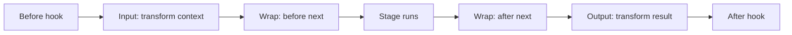

Middleware is a mechanism for wrapping stages of an agent to influence or change how
the agent executes. A middleware handler can transform what goes into a model call or
tool execution, transform what comes back, or wrap the whole operation to retry it,
cache it, reroute it, or skip it entirely.

Reach for middleware when you need to control the flow of a stage, and use
[hooks](hooks.md) when you only want to observe it. Middleware is the right tool when you
want to wrap a stage and decide whether, and how many times, it runs: retry on a
throttle, serve a cached response, or hold a tool call for human approval.

## Stages and phases

A stage is an interception point in the agent run. Each stage has a context (what goes
in) and a result (what comes back), and its handlers can transform either one.

### Available stages

<Tabs>
<Tab label="Python">

| Stage | Wraps | Context | Result |
|-------|-------|---------|--------|
| [`InvokeModelStage`](@api/python/strands.middleware.stages#InvokeModelStage) | A single model call | [`InvokeModelContext`](@api/python/strands.middleware.stages#InvokeModelContext) | `ModelStopReason` |
| [`ExecuteToolStage`](@api/python/strands.middleware.stages#ExecuteToolStage) | A single tool call | [`ExecuteToolContext`](@api/python/strands.middleware.stages#ExecuteToolContext) | `ToolResultEvent` |

</Tab>
<Tab label="TypeScript">

| Stage | Wraps | Context | Result |
|-------|-------|---------|--------|
| [`InvokeModelStage`](@api/typescript/InvokeModelStage) | A single model call | [`InvokeModelContext`](@api/typescript/InvokeModelContext) | [`InvokeModelResult`](@api/typescript/InvokeModelResult) |
| [`ExecuteToolStage`](@api/typescript/ExecuteToolStage) | A single tool call | [`ExecuteToolContext`](@api/typescript/ExecuteToolContext) | [`ExecuteToolResult`](@api/typescript/ExecuteToolResult) |

</Tab>
</Tabs>

Tool execution also supports
[human-in-the-loop interrupts](#gating-tool-execution-on-human-approval).

### Phases

Each stage exposes three phases, and every phase runs in the same fixed order no matter
what order you register handlers in:

- **Input** transforms the context before the stage runs.
- **Wrap** is the full wrap: the handler receives the context and a `next` function, and
  decides when (and whether) to call it. Calling `next` zero times short-circuits the
  stage, once passes it through, and more than once retries it.
- **Output** transforms the result after the stage runs. The handler receives and returns
  a result wrapper.

Input transforms the context, Wrap wraps the stage (whose work runs inside it), and Output
transforms the result on the way back out.



## Middleware registration

Register a handler with <Syntax py="agent.add_middleware()" ts="agent.addMiddleware()" />,
passing a stage token for the Wrap phase or a phase sub-token for a pure transform.

Transform the context before the model runs with the Input phase:

<Tabs>
<Tab label="Python">

```python
from strands import Agent
from strands.middleware import InvokeModelStage

agent = Agent()

def be_concise(context):
    return context.replace(system_prompt="Be concise.")

agent.add_middleware(InvokeModelStage.Input, be_concise)
```

Treat the context as immutable: use its `replace()` method to produce a modified copy
rather than mutating it in place.

</Tab>
<Tab label="TypeScript">

```typescript
--8<-- "user-guide/sdk/agents/middleware_imports.ts:register_input_imports"

--8<-- "user-guide/sdk/agents/middleware.ts:register_input"
```

The context is read-only, so return a modified copy with object spread rather than
mutating it in place.

</Tab>
</Tabs>

The new prompt applies to this model call only.
<Syntax py="agent.system_prompt" ts="agent.systemPrompt" /> is unchanged, so the next call
starts from it again.

Transform the result after the model runs with the Output phase:

<Tabs>
<Tab label="Python">

```python
from strands import Agent
from strands.middleware import InvokeModelStage

agent = Agent()

def log_stop_reason(result):
    stop_reason, message, usage, metrics = result.value["stop"]
    print(f"model stopped with reason {stop_reason}")
    return result

agent.add_middleware(InvokeModelStage.Output, log_stop_reason)
```

</Tab>
<Tab label="TypeScript">

```typescript
--8<-- "user-guide/sdk/agents/middleware_imports.ts:register_output_imports"

--8<-- "user-guide/sdk/agents/middleware.ts:register_output"
```

</Tab>
</Tabs>

For full control, register a Wrap handler on the bare stage token. It is an async
generator: stream events through, and hand back the stage result as the generator's final
value.

<Tabs>
<Tab label="Python">

```python
import time
from strands import Agent
from strands.middleware import InvokeModelStage

agent = Agent()

async def timing(context, next_fn):
    start = time.monotonic()
    async for event in next_fn(context):
        yield event
    print(f"model call took {time.monotonic() - start:.2f}s")

agent.add_middleware(InvokeModelStage, timing)
```

An async generator cannot return a value, so the last event it yields is the stage result.

</Tab>
<Tab label="TypeScript">

```typescript
--8<-- "user-guide/sdk/agents/middleware_imports.ts:register_wrap_imports"

--8<-- "user-guide/sdk/agents/middleware.ts:register_wrap"
```

The result is the value the generator returns via `yield* next(context)`. Registration
returns a cleanup function; call it to remove the handler.

</Tab>
</Tabs>

## Retrying, caching, and short-circuiting

The Wrap phase controls how often the stage runs, which is what makes retries, caches, and
short-circuits possible. Call `next` again to retry:

<Tabs>
<Tab label="Python">

```python
import asyncio
from strands import Agent
from strands.middleware import InvokeModelStage
from strands.types.exceptions import ModelThrottledException

agent = Agent()

async def retry_on_throttle(context, next_fn):
    for attempt in range(3):
        try:
            async for event in next_fn(context):
                yield event
            return
        except ModelThrottledException:
            if attempt == 2:
                raise
            await asyncio.sleep(2 ** attempt)

agent.add_middleware(InvokeModelStage, retry_on_throttle)
```

</Tab>
<Tab label="TypeScript">

```typescript
--8<-- "user-guide/sdk/agents/middleware_imports.ts:retry_imports"

--8<-- "user-guide/sdk/agents/middleware.ts:retry"
```

</Tab>
</Tabs>

This is an alternative to the agent's [retry strategy](retry-strategies.md), which
already retries throttled model calls with exponential backoff by default. If you use
retry middleware instead, disable the strategy so the two don't stack: the strategy runs
outside the middleware chain, so each of its retries runs your middleware again.

To short-circuit, produce a result without calling `next`. A response cache does this:
return the stored result on a hit, and only call the model on a miss.

<Tabs>
<Tab label="Python">

```python
import json
from strands import Agent
from strands.middleware import InvokeModelStage

agent = Agent()
response_cache = {}

async def cache_responses(context, next_fn):
    key = json.dumps(context.messages, default=str)
    if key in response_cache:
        yield response_cache[key]
        return

    result_event = None
    async for event in next_fn(context):
        result_event = event
        yield event
    response_cache[key] = result_event

agent.add_middleware(InvokeModelStage, cache_responses)
```

Because the last yielded event is the result, the cache stores that final event and yields
it back on a hit.

</Tab>
<Tab label="TypeScript">

```typescript
--8<-- "user-guide/sdk/agents/middleware_imports.ts:cache_imports"

--8<-- "user-guide/sdk/agents/middleware.ts:cache"
```

</Tab>
</Tabs>

## Routing a call to a different model

The model on the context is per-call and replaceable. Swap it in an Input handler to route
a single call to a different model without touching agent state. The model you set also
drives the model ID recorded on the call's trace span. This routes oversized requests to a
larger-context model:

<Tabs>
<Tab label="Python">

```python
from strands import Agent
from strands.middleware import InvokeModelStage
from strands.models import BedrockModel

agent = Agent()
large_context_model = BedrockModel(
    model_id="us.anthropic.claude-sonnet-4-20250514-v1:0"
)

def route_by_size(context):
    if (context.projected_input_tokens or 0) > 50_000:
        return context.replace(model=large_context_model)
    return context

agent.add_middleware(InvokeModelStage.Input, route_by_size)
```

</Tab>
<Tab label="TypeScript">

```typescript
--8<-- "user-guide/sdk/agents/middleware_imports.ts:model_routing_imports"

--8<-- "user-guide/sdk/agents/middleware.ts:model_routing"
```

</Tab>
</Tabs>

## Gating tool execution on human approval

Tool-execution middleware can pause a run and wait for a person, using the context's
`interrupt` method. The first call halts the agent with an [interrupt](../interrupts.md);
when the caller resumes with a response, the same call returns it. Deny the call by
returning an error result, or approve it by passing through to `next`.

<Tabs>
<Tab label="Python">

```python
from strands import Agent
from strands.middleware import ExecuteToolStage, ToolResultEvent

agent = Agent()

async def approval_gate(context, next_fn):
    approval = context.interrupt(
        "approve_tool", reason=f"Run {context.tool_use['name']}?"
    )
    if approval.response != "approved":
        yield ToolResultEvent({
            "toolUseId": context.tool_use["toolUseId"],
            "status": "error",
            "content": [{"text": "Denied by reviewer"}],
        })
        return
    async for event in next_fn(context):
        yield event

agent.add_middleware(ExecuteToolStage, approval_gate)
```

</Tab>
<Tab label="TypeScript">

```typescript
--8<-- "user-guide/sdk/agents/middleware_imports.ts:tool_gate_imports"

--8<-- "user-guide/sdk/agents/middleware.ts:tool_gate"
```

</Tab>
</Tabs>

## How middleware relates to hooks

Middleware and [hooks](hooks.md) both extend a running agent, and both can fire on the
same stage. The difference is where they sit: hooks fire outside the middleware chain,
wrapping it, and they work differently:

- **Hooks always fire, even when middleware short-circuits.** A cache that returns without
  calling `next` still triggers the Before and After hooks for that stage, so anything
  counting calls sees the attempt.
- **A retry produces one hook pair, not many.** Middleware that calls `next` three times
  is invisible to hooks, which only see the outermost call and result. If you need
  per-attempt observability, put that logic in middleware, not a hook.
- **Hooks change agent state; middleware changes the call.** To give one model call a
  different system prompt from a hook, you set
  <Syntax py="agent.system_prompt" ts="agent.systemPrompt" /> and restore it afterward.
  Middleware passes a modified context to `next`, and the agent's own state is never
  touched.

Trace spans record post-middleware state: the model-invoke span captures the messages,
system prompt, and model the call actually used, reflecting every transformation
middleware applied on the way in.
